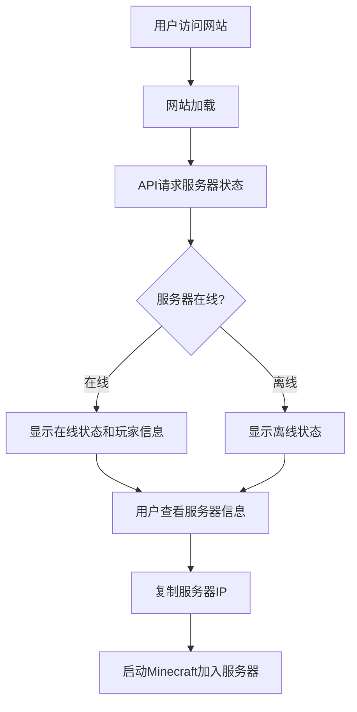
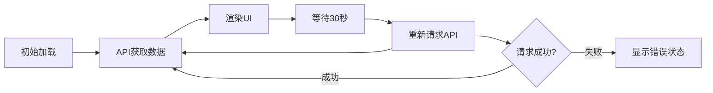

# 火教集团附属服务器 - 官方网站产品需求文档

## 1. 产品概述

### 项目简介

"火教集团附属服务器"官方门户网站，为Minecraft 1.20.1版本的Forge MTR（火车模组）服务器提供在线展示和玩家互动平台。网站通过实时API数据展示服务器状态，让玩家无需进入游戏即可了解服务器运行情况。

### 核心价值

* **实时状态监控**：通过API实时获取并展示服务器在线状态、玩家数量等信息

* **品牌形象展示**：打造专业的MTR服务器品牌形象

* **玩家社区入口**：提供服务器相关信息和连接指南

### 目标用户

* 潜在玩家：想了解服务器但尚未加入的玩家

* 现有玩家：需要查看服务器状态的活跃玩家

* 服务器管理团队：展示服务器信息和统计数据

## 2. 核心功能

### 2.1 功能模块

1. **首页**

   * 服务器状态实时展示（在线人数、最大人数、服务器延迟等）

   * 服务器IP地址一键复制功能

   * 服务器特色介绍

   * 快速加入指南

2. **服务器状态卡片**

   * 实时在线玩家数量

   * 服务器在线/离线状态指示

   * 服务器版本显示

   * MOTD信息展示

   * 自动刷新机制（每30秒刷新一次）

3. **服务器信息展示**

   * 服务器名称和标语

   * 游戏版本

   * 模组信息简介

   * 连接说明和教程

4. **视觉设计**

   * MTR主题风格的视觉设计

   * 火车/铁路元素融入

   * 现代化的卡片式布局

   * 响应式设计，适配各种设备

## 3. 核心流程

### 3.1 用户访问流程



### 3.2 数据刷新流程



## 4. 用户界面设计

### 4.1 设计风格

#### 整体风格定位

* **主题方向**：工业蒸汽朋克 + 现代简约

* **设计理念**：融合MTR火车模组的铁路/工业美学

* **色彩氛围**：稳重、专业、带有工业质感

#### 配色方案

* **主色调**：深灰色 (#2D3436) - 代表工业钢铁

* **次要色**：暖橙色 (#E17055) - 代表火车灯光/温暖

* **强调色**：金色 (#FDCB6E) - 代表黄铜/经典

* **背景色**：深蓝灰 (#0C1117) - 营造沉稳氛围

* **文字色**：白色/浅灰 (#FFFFFF / #B2BEC3)

#### 排版设计

* **标题字体**：Bebas Neue / Oswald - 工业感强

* **正文字体**：Roboto Condensed / Noto Sans SC - 清晰易读

* **数字字体**：Orbitron - 科技感数字展示

#### 布局方式

* **整体布局**：单页应用，卡片式设计

* **导航方式**：简洁顶部导航栏

* **内容组织**：垂直滚动，信息层级清晰

### 4.2 页面设计详情

#### 首页布局

```
┌─────────────────────────────────────┐
│  顶部导航栏                          │
├─────────────────────────────────────┤
│                                     │
│  Hero区域 - 服务器名称+标语          │
│  大气的背景图+动画效果               │
│                                     │
├─────────────────────────────────────┤
│                                     │
│  服务器状态卡片（核心功能）           │
│  - 在线状态指示灯                   │
│  - 玩家数量显示                     │
│  - 服务器IP一键复制                 │
│  - 实时数据更新                     │
│                                     │
├─────────────────────────────────────┤
│                                     │
│  服务器信息模块                      │
│  - 版本信息                         │
│  - 模组介绍                         │
│  - 连接教程                         │
│                                     │
└─────────────────────────────────────┘
```

#### UI元素设计

1. **状态指示器**

   * 在线：绿色脉冲动画指示灯

   * 离线：红色静态指示灯

   * 加载中：橙色旋转动画

2. **按钮设计**

   * 圆角按钮，边框略带金属质感

   * 悬停时有光泽效果

   * 点击有按压反馈

3. **卡片设计**

   * 半透明玻璃拟态效果

   * 微妙的边框发光

   * 悬停时轻微上浮效果

4. **动画效果**

   * 页面加载：渐入动画

   * 数字变化：计数动画

   * 状态切换：平滑过渡

   * 背景：缓慢移动的纹理

### 4.3 响应式设计

* **桌面端 (≥1200px)**：完整布局，大尺寸展示

* **平板端 (768px-1199px)**：自适应布局，保持核心功能

* **移动端 (<768px)**：垂直布局，触摸优化，保持可读性

### 4.4 特殊效果

#### 背景效果

* 动态网格线背景（模拟铁路轨道）

* 微妙的渐变光晕

* 可选：粒子效果模拟火车蒸汽

#### 交互反馈

* 所有可点击元素有明显悬停效果

* 复制成功显示提示动画

* 加载状态显示骨架屏或加载动画

## 5. 技术实现要求

### 5.1 前端技术

* **框架**：React 18 + Vite

* **样式**：Tailwind CSS

* **动画**：CSS动画 + Framer Motion (可选)

* **HTTP请求**：Fetch API 或 Axios

### 5.2 API集成

* **接口地址**：`https://motdbe.blackbe.work/api/java?host=play.simpfun.cn:31313`

* **刷新策略**：每30秒自动刷新

* **错误处理**：优雅降级，显示友好错误信息

* **缓存策略**：本地缓存最新数据

### 5.3 性能要求

* 首屏加载时间 < 3秒

* API响应后即时更新UI

* 流畅的动画效果（60fps）

* 良好的移动端性能

### 5.4 浏览器兼容

* Chrome/Edge (最新版)

* Firefox (最新版)

* Safari (最新版)

* 移动端浏览器

## 6. 验收标准

### 功能性验收

* [ ] 网站能正常加载并显示

* [ ] API数据能正确获取并展示

* [ ] 状态信息实时更新（每30秒）

* [ ] 服务器IP一键复制功能正常

* [ ] 错误状态友好展示

### 视觉验收

* [ ] MTR主题风格明确

* [ ] 色彩搭配协调

* [ ] 动画效果流畅

* [ ] 响应式布局正常

* [ ] 整体视觉效果专业

### 性能验收

* [ ] 页面加载流畅

* [ ] 无明显卡顿

* [ ] 移动端体验良好

## 7. 可选增强功能（Phase 2）

* 服务器在线玩家名单展示

* 服务器统计历史图表

* 夜间/日间模式切换

* 多语言支持

* 社交媒体分享功能

* 服务器规则页面

* 玩家指南/WIKI链接

