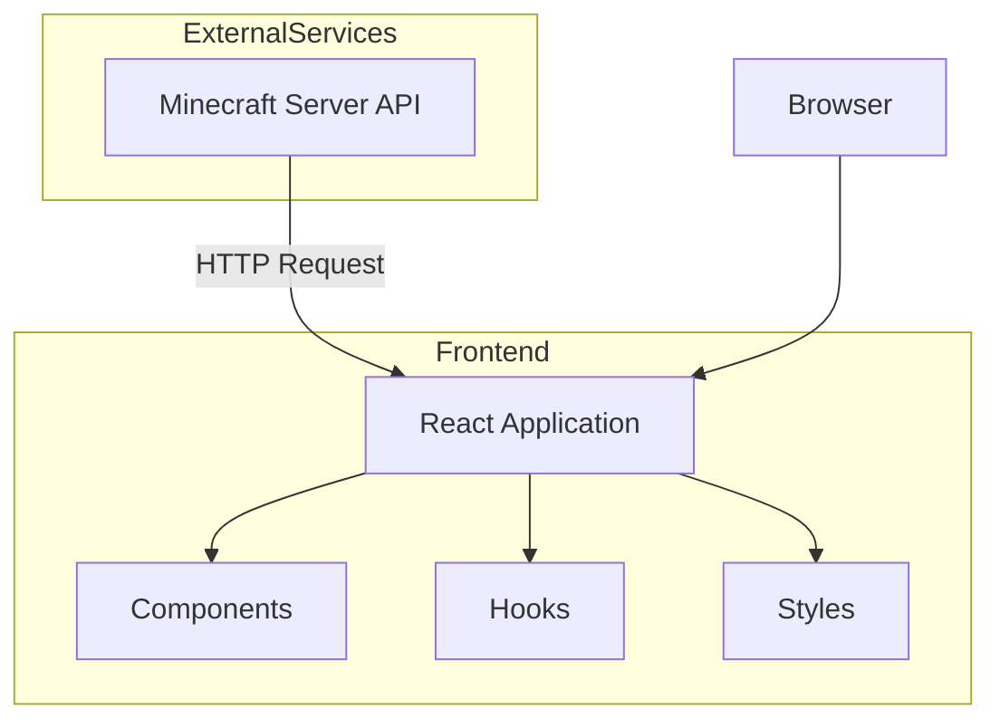
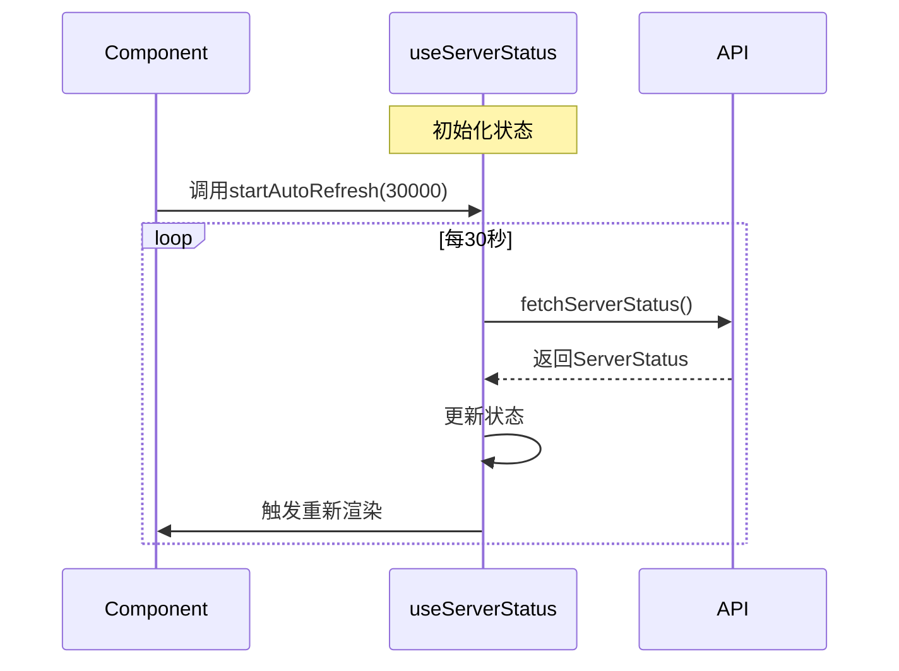
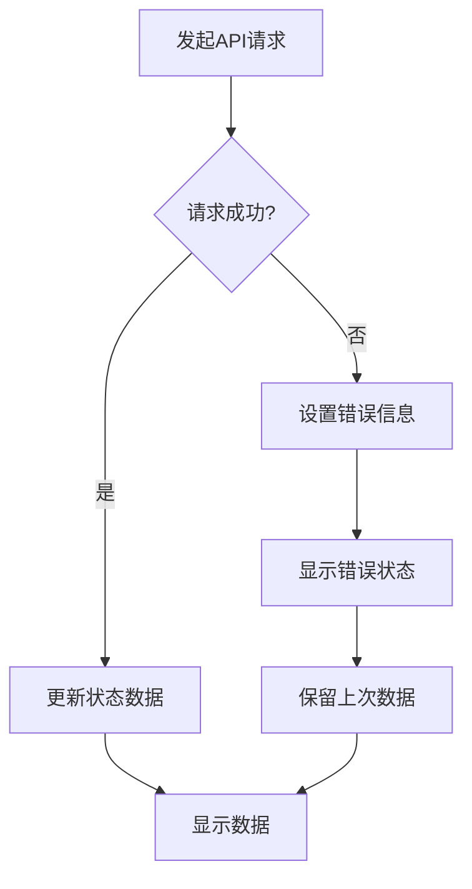

# 火教集团附属服务器 - 技术架构文档

## 1. 架构设计

### 1.1 整体架构

本项目采用**前后端分离架构**，前端为单页应用（SPA），通过API获取服务器状态数据。



### 1.2 技术栈

- **前端框架**：React 18
- **构建工具**：Vite
- **样式方案**：Tailwind CSS
- **HTTP客户端**：Fetch API
- **图标库**：Lucide React
- **动画库**：Framer Motion

## 2. 技术描述

### 2.1 项目结构

```
huojiao-website/
├── public/
│   └── favicon.ico
├── src/
│   ├── components/
│   │   ├── Header.tsx
│   │   ├── Hero.tsx
│   │   ├── ServerStatus.tsx
│   │   ├── ServerInfo.tsx
│   │   └── Footer.tsx
│   ├── hooks/
│   │   └── useServerStatus.ts
│   ├── services/
│   │   └── api.ts
│   ├── types/
│   │   └── server.ts
│   ├── App.tsx
│   ├── main.tsx
│   └── index.css
├── index.html
├── package.json
├── vite.config.ts
├── tailwind.config.js
├── tsconfig.json
└── README.md
```

### 2.2 核心技术组件

#### 2.2.1 React组件
- **Header**: 顶部导航栏组件
- **Hero**: 主横幅区域
- **ServerStatus**: 服务器状态展示卡片（核心组件）
- **ServerInfo**: 服务器详细信息模块
- **Footer**: 页脚组件

#### 2.2.2 自定义Hooks
- **useServerStatus**: 管理服务器状态数据获取和刷新逻辑

#### 2.2.3 工具函数
- **api.ts**: API请求封装和错误处理

## 3. 路由定义

由于本项目为单页应用，路由结构简单：

| 路由 | 页面 | 说明 |
|------|------|------|
| / | 首页 | 包含所有功能模块的完整页面 |

## 4. API定义

### 4.1 服务器状态API

**请求信息**
- **接口地址**：`https://motdbe.blackbe.work/api/java?host=play.simpfun.cn:31313`
- **请求方法**：GET
- **请求头**：
  ```
  Content-Type: application/json
  ```

**响应数据结构**

```typescript
interface ServerStatus {
  online: boolean;           // 服务器是否在线
  ip: string;                // 服务器IP地址
  port: number;              // 服务器端口
  hostname: string;          // 服务器MOTD名称
  version: string;           // 游戏版本
  protocol: number;          // 协议版本
  players: {
    online: number;           // 在线玩家数量
    max: number;              // 最大玩家数量
    list: string[];          // 在线玩家名称列表
  };
  mods: Array<{
    name: string;            // 模组名称
    version: string;         // 模组版本
  }>;
  ping: number;              // 服务器延迟(ms)
  uptime: number;            // 服务器运行时间
  error?: string;           // 错误信息(如果请求失败)
}
```

**成功响应示例**
```json
{
  "online": true,
  "ip": "play.simpfun.cn",
  "port": 31313,
  "hostname": "火教集团附属服务器",
  "version": "1.20.1",
  "protocol": 763,
  "players": {
    "online": 15,
    "max": 100,
    "list": ["Player1", "Player2"]
  },
  "mods": [
    {"name": "MTR", "version": "3.1.14"},
    {"name": "其他模组"}
  ],
  "ping": 45,
  "uptime": 86400000
}
```

**错误响应**
```json
{
  "error": "服务器连接失败"
}
```

### 4.2 前端API调用封装

```typescript
// src/services/api.ts
const API_URL = 'https://motdbe.blackbe.work/api/java';
const SERVER_HOST = 'play.simpfun.cn:31313';

export async function fetchServerStatus(): Promise<ServerStatus> {
  const response = await fetch(`${API_URL}?host=${SERVER_HOST}`);
  if (!response.ok) {
    throw new Error('获取服务器状态失败');
  }
  return response.json();
}
```

## 5. 数据模型

### 5.1 状态管理

```typescript
interface ServerStatusState {
  data: ServerStatus | null;      // 服务器状态数据
  loading: boolean;                // 加载状态
  error: string | null;            // 错误信息
  lastUpdated: Date | null;        // 最后更新时间
}
```

### 5.2 Hook返回类型

```typescript
interface UseServerStatusReturn {
  status: ServerStatusState;       // 状态数据
  refresh: () => void;              // 手动刷新函数
  startAutoRefresh: (interval?: number) => void;  // 开始自动刷新
  stopAutoRefresh: () => void;     // 停止自动刷新
}
```

## 6. 核心实现逻辑

### 6.1 自动刷新机制



### 6.2 错误处理流程



## 7. 性能优化策略

### 7.1 加载优化
- 使用Vite进行代码分割和压缩
- 图片资源优化和懒加载
- Tailwind CSS按需编译

### 7.2 运行优化
- React.memo避免不必要的重渲染
- useMemo和useCallback优化计算和函数创建
- 数据缓存减少重复请求

### 7.3 用户体验优化
- 骨架屏或加载动画
- 优雅的错误提示
- 流畅的状态切换动画

## 8. 环境配置

### 8.1 开发环境
- Node.js: >= 18.0.0
- npm: >= 9.0.0

### 8.2 启动命令
```bash
# 安装依赖
npm install

# 开发模式启动
npm run dev

# 生产构建
npm run build

# 预览生产构建
npm run preview
```

## 9. 浏览器兼容性

| 浏览器 | 最低版本 | 推荐版本 |
|--------|----------|----------|
| Chrome | 90+ | 最新版 |
| Firefox | 88+ | 最新版 |
| Safari | 14+ | 最新版 |
| Edge | 90+ | 最新版 |

## 10. 部署方案

### 10.1 静态部署
由于本项目为纯前端应用，可部署到以下平台：
- Vercel
- Netlify
- GitHub Pages
- 阿里云OSS
- 任意静态文件托管服务

### 10.2 构建产物
- `dist/` 目录包含所有静态文件
- 无需服务端渲染或API代理
- CORS配置由API服务端控制
